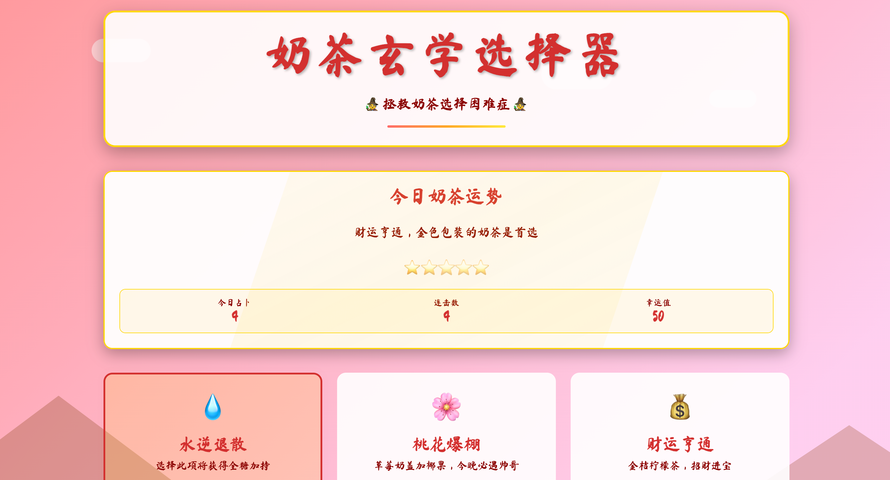

# 🧋 Milk Tea Mystic Selector 奶茶玄学推荐器

<div align="right"><a href="https://yigather.com/milk-tea-mystic-selector/index.html">线上体验地址 →</a></div>

<div align="center">
  
</div>

让每个选择都变得轻松、有趣、无压力。

[](https://github.com/louislili/milk-tea-mystic-selector)
[](./LICENSE)

---

## 📁 仓库结构

- `milk-tea-mystic-selector/`：开源项目的全部代码与文档（请从此目录开始）

建议直接进入项目目录查看更详细的文档：

- 入口页面：`milk-tea-mystic-selector/index.html`
- 详细说明：`milk-tea-mystic-selector/README.md`
- 入门指南：`milk-tea-mystic-selector/docs/GettingStarted.md`
- 部署指南：`milk-tea-mystic-selector/docs/Deployment.md`

---

## 🚀 快速本地体验

在项目目录下启动本地静态服务（任选其一）：

```bash
cd milk-tea-mystic-selector
python3 -m http.server 8080
# 或者
npx serve . -p 8080
```

然后访问 `http://localhost:8080`。

> 提示：项目是纯前端零依赖，直接用浏览器打开 `index.html` 也可以。

---

## ✨ 核心亮点

- 纯前端 · 零依赖 · 开箱即用
- 游戏化体验：奖励、成就、运势文本
- 隐私友好：数据仅存储在本地 LocalStorage
- 高效选择：键盘快捷键 1-6 一键选择

---

## 🎮 游戏玩法

- 选择需求：在 6 张卡片中选出你今天最需要的（能量 / 舒适 / 社交 / 冒险 / 专注 / 惊喜）。
- 快速决策：点击卡片或按键 `1-6`，立即获得推荐口味与专属运势文案。
- 领取奖励：点击奖励按钮，触发「Buff / 连击 / 成就」等趣味效果，数据自动本地保存。
- 持续积累：完成成就、提升连击数，逐步解锁更多趣味文本与成就感。

---

## 🎈 趣味点（让选择不再枯燥）

- 玄学运势文本：每天都有不同的“奶茶命运”彩蛋。
- Buff 系统：领取奖励为今天打气；越用越有仪式感。
- 连击追踪：连续使用会提升“选择连击值”，激发成就感。
- 成就徽章：基于选择行为解锁成就，形成正向反馈。
- 轻动画与弹窗：恰到好处的动效与美化弹窗，提升愉悦度。

---

## 🧩 功能点（实用且可扩展）

- 六大核心选择映射：不同需求 -> 对应奶茶与文案。
- 奖励按钮：一键领取今日 Buff / 连击 / 成就。
- 成就系统：基于选择频次、类型与连续性进行统计与解锁。
- 数据持久化：全部数据存储在浏览器 `LocalStorage`，离线可用。
- 快捷操作：按键 `1-6` 快速选择，提高决策效率。
- 响应式设计：移动端与桌面端均友好展示。
- 易于改造：修改 `script.js` 中的映射即可拓展到咖啡、午餐、内容推荐等场景。

---

## 🔗 相关链接

- 项目主目录：[`./milk-tea-mystic-selector/`](./milk-tea-mystic-selector/)
- 官方介绍：`https://yigather.com`

---

## 📄 许可证

本项目采用 MIT 许可证，详见 [`LICENSE`](./LICENSE)。